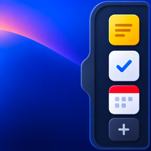

  

<h1 align="center">Sidepocket</h1>

  <strong>작은 업무를, 화면 옆의 주머니에.</strong> 
  할 일, 읽을거리, 서비스 상태와 메모를 한곳에 모아두는 macOS 유틸리티입니다.

  
  
  
  

  <a href="https://github.com/taekilKim/sidepocket-releases/releases/latest"><strong>최신 버전 다운로드</strong></a>
  ·
  <a href="https://github.com/taekilKim/sidepocket-releases/releases">릴리스 노트</a>
  ·
  <a href="https://github.com/taekilKim/sidepocket-releases/issues">피드백 보내기</a>

---

Sidepocket은 주 업무 화면을 떠나지 않고 자잘한 일을 잠깐 처리하기 위한 작은 사이드 패널입니다. 필요할 때 화면 가장자리에서 꺼내 쓰고, 일이 끝나면 다시 접어둘 수 있습니다.

## 한 주머니에 모은 네 가지 도구

| | 기능 | 할 수 있는 일 |
| --- | --- | --- |
| ✓ | **Today** | 오늘 할 일과 나중에 할 일을 정리하고, 완료하거나 드래그해 순서를 바꿉니다. |
| ◔ | **Feed** | RSS·Atom 피드를 카테고리별로 구독하고 등록 이후의 새 글을 모아봅니다. |
| ● | **Status** | OpenAI, Figma, Slack, GitHub 등 자주 쓰는 서비스의 공개 상태를 한곳에서 확인합니다. |
| ✎ | **Notes** | 지금 기억할 내용을 빠르게 적고 검색합니다. |

## 화면 가장자리에 맞춰 사용하세요

- 패널을 화면 왼쪽 또는 오른쪽에 배치할 수 있습니다.
- 고정하면 다른 앱을 사용하는 동안에도 계속 표시됩니다.
- 고정을 해제하면 화면 가장자리로 커서를 가져갈 때 다시 나타납니다.
- 사이드바만 남기거나 전체 패널을 펼쳐둘 수 있습니다.
- 앱 크기를 90%부터 110%까지 조절할 수 있습니다.
- 로그인 시 자동 실행과 앱 외부 클릭 시 자동 축소 여부를 선택할 수 있습니다.

## 설치

1. [최신 Release](https://github.com/taekilKim/sidepocket-releases/releases/latest)에서 `Sidepocket-버전-unsigned.dmg`를 다운로드합니다.
2. DMG를 열고 Sidepocket을 `Applications` 폴더로 옮깁니다.
3. Applications 폴더에서 Sidepocket을 실행합니다.

> [!IMPORTANT]
> 현재 배포본은 Apple Developer ID로 서명되지 않은 무료 버전입니다. 처음 실행할 때 “확인되지 않은 개발자” 경고가 표시되면 Finder에서 Sidepocket을 `Control-클릭`한 다음 `열기`를 선택해 주세요. 이후에는 일반적인 방법으로 실행할 수 있습니다.

### 시스템 요구 사항

- macOS 13 Ventura 이상
- Apple Silicon 및 Intel Mac 지원
- 인터넷 연결 없이도 Today와 Notes를 비롯한 로컬 기능 사용 가능

## 오프라인과 데이터

Today, Notes, 설정과 사용자가 추가한 데이터는 Mac의 로컬 저장소에 보관됩니다. 별도의 계정이나 클라우드 동기화가 필요하지 않습니다.

인터넷 연결이 없을 때도 로컬 기능은 계속 사용할 수 있습니다. Feed와 Status는 마지막으로 저장된 내용을 표시하며, 새 글·서비스 상태·앱 업데이트 확인은 다시 온라인이 된 뒤 갱신됩니다.

## 업데이트

새 버전이 나오면 Sidepocket의 설정 화면에서 현재 버전과 최신 버전을 확인하고 다운로드할 수 있습니다. 모든 설치 파일과 버전별 변경 사항은 이 저장소의 [Releases](https://github.com/taekilKim/sidepocket-releases/releases)에 게시됩니다.

## 피드백과 서비스 요청

버그를 발견했거나 개선 의견이 있다면 [Issue를 남겨 주세요](https://github.com/taekilKim/sidepocket-releases/issues/new). Status에서 트래킹하고 싶은 서비스가 목록에 없다면 [서비스 추가 요청](https://github.com/taekilKim/sidepocket-releases/issues/new?title=%5BStatus%20request%5D%20)을 보내 주세요.

## 이 저장소에 대하여

이곳은 Sidepocket의 공식 공개 배포 저장소입니다. 설치 파일, SHA-256 체크섬, 업데이트 확인용 버전 정보와 릴리스 노트를 제공합니다.

Sidepocket의 소스 코드는 포함되어 있지 않으며, 이 저장소는 오픈소스 프로젝트가 아닙니다.

---

  Made by 김태길 · Copyright © 2026. All rights reserved.

